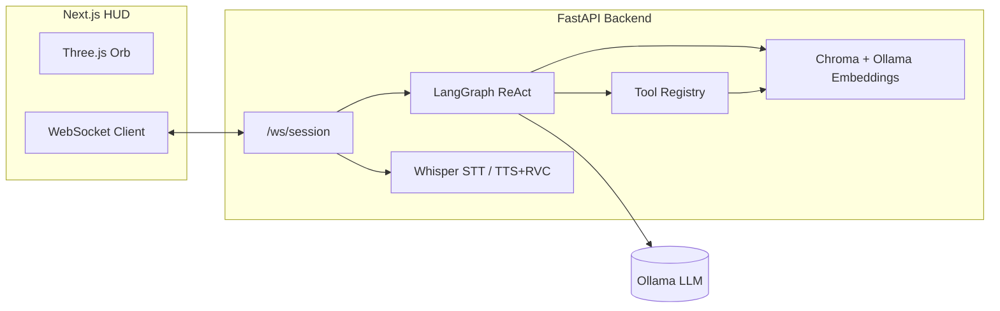

# Jarvis — Local-First Holographic AI Assistant

Production-oriented monorepo for a **fully local** Iron-Man–inspired assistant: **FastAPI**
orchestration, **LangGraph** tool routing, **Ollama** models, **ChromaDB** memory, **Faster-Whisper**
STT, and a **Next.js** holographic HUD with **React Three Fiber**.

> **Voice note:** High-fidelity cinematic cloning is your responsibility to license and
> engineer. This repo wires **XTTS‑v2 / Coqui**, **RVC** post-processing hooks, and a
> **macOS `say` + Daniel** fallback for instant feedback while you tune models.

---

## Architecture



### macOS-native backend (required for Finder and real disks)

Run the **FastAPI / LangGraph backend on the host Mac**, not inside a generic app container.

Jarvis file tools depend on the **real macOS environment**: Finder, **`/usr/bin/open`**, AppleScript / Automation, Accessibility, Spotlight (`mdfind`), and **host paths** (`Path.home()`, `~/Downloads`, etc.). A normal Linux container **does not** see your Mac’s filesystem or GUI session unless you deliberately mount paths and accept limited behaviour.

**Do:**

- Start **uvicorn** from `backend/` on macOS (`python -m uvicorn app.main:app …`).
- Use **Docker only for isolated services** (e.g. **Ollama** in `docker-compose.yml`), with the API still on the host pointing at `http://127.0.0.1:11434`.
- If you ever containerize the API for experiments, **bind-mount** the host directories you intend to operate on and understand that **Finder / `open`** still won’t behave like a native desktop process unless you use **delegation** (browser → `jarvis_file_bridge.py` on the Mac).

**Don’t:**

- Assume `create_folder_for_user`, Spotlight search, or `open_path` target your Mac when the API process runs in a container with only container-local volumes.
- Treat Docker’s filesystem as the source of truth for “your computer.”

All Finder-related and filesystem tooling in this repo is **designed for a native macOS backend** (with optional client delegation when the API is off-host).

### macOS manual permission checklist (do this once per machine)

The HUD and `GET http://127.0.0.1:8000/health/macos` **re-run probes at runtime** and list anything that still blocks Finder, `open`, or protected folders.

1. **Run the API on the host (required)**  
   - From **Terminal** or **Cursor’s terminal**: `cd backend && source .venv/bin/activate && uvicorn app.main:app --host 127.0.0.1 --port 8000`  
   - Or: `./scripts/run_backend_native_macos.sh` (refuses to run if `/.dockerenv` exists).  
   - Use **Docker only** for optional services (`docker compose up -d ollama`), not for the FastAPI process if you want real `~/Desktop` / Spotlight / AppleScript.

2. **Full Disk Access** — *System Settings → Privacy & Security → Full Disk Access*  
   - Add the app that **starts Python**: **Terminal**, **iTerm**, or **Cursor** (when you launch uvicorn from the IDE).  
   - If you invoke `/usr/bin/python3` directly, you may also need that binary or its wrapper—check the HUD line **Host Python** for the exact path.  
   - **After toggling:** **Quit the app completely** (Cmd+Q from Dock), reopen it, start uvicorn again.

3. **Files and Folders** — same Privacy page  
   - Enable **Desktop**, **Documents**, **Downloads** (and **Network Volumes** if you use NAS) for Terminal/Cursor.

4. **Automation (Finder)** — *Privacy & Security → Automation*  
   - Allow **Terminal** or **Cursor** to control **Finder** when prompted—or enable it manually in Automation.

5. **Accessibility** — *Privacy & Security → Accessibility*  
   - Add **Terminal** / **Cursor** if AppleScript to **System Events** fails or macOS prompts for accessibility.

6. **Microphone**  
   - **Browser HUD:** allow the mic for `http://localhost:3000`.  
   - **`./jarvis` script:** allow **Terminal** under *Privacy & Security → Microphone*.

7. **Native `open` vs bridge**  
   - On a bare Mac, set `JARVIS_FILE_ACTIONS_MODE=server` (or leave `auto`) so the API uses **`/usr/bin/open`**. Use `client` + `jarvis_file_bridge.py` only when the API is remote or containerized.

8. **Ollama**  
   - If Ollama runs in Docker, point `OLLAMA_BASE_URL=http://127.0.0.1:11434` at the host port—still start **Jarvis’ API** natively.

---

### Data flow (voice or text)

1. UI captures **text** or **PCM audio** (base64) → WebSocket `audio_chunk` / `user_text`.
2. **Faster-Whisper** transcribes audio; **wake-word** gating optional (`wake_mode`).
3. **LangGraph** ReAct agent calls **Ollama** and **tools** (filesystem, terminal allowlist, apps, web, memory, email/calendar stubs).
4. **ChromaDB** stores/recalls long-term context via **Ollama `nomic-embed-text`** (pull separately).
5. **TTS** synthesizes speech; browser plays returned **WAV** while the **orb** enters `speaking`.

---

## Repository layout

```text
.
├── backend/
│   ├── app/
│   │   ├── main.py              # FastAPI + WebSocket session loop
│   │   ├── config.py            # Pydantic settings / env mapping
│   │   ├── agent/graph.py       # LangGraph ReAct + memory augmentation
│   │   ├── tools/builtin.py     # Core tools + plugin merge
│   │   ├── memory/store.py      # Chroma persistent + Ollama embeddings
│   │   ├── voice/               # STT, TTS, session orchestration
│   │   ├── security/permissions.py
│   │   └── plugins/registry.py  # Optional third-party tool discovery
│   ├── requirements.txt
│   └── data/                    # Runtime chroma + sessions (gitignored)
├── frontend/
│   ├── app/                     # Next.js App Router
│   ├── components/            # HUD + HologramOrb (R3F)
│   └── lib/useJarvisSession.ts # WebSocket + audio playback
├── assets/                      # Optional voice reference (see assets/README.md)
├── docker-compose.yml           # Ollama only (optional); do not run the Jarvis API here for Mac file tools
├── .env.example
└── README.md
```

---

## Prerequisites

- **Python 3.11+** (3.13 tested).
- **Node.js 20+** for the frontend.
- **Ollama** with pulled models (see tiers below).
- **ffmpeg** (optional but recommended) to convert macOS `say` output to WAV for the browser.
- **Docker** (optional) to host **Ollama** (see `docker-compose.yml`). The **Jarvis API itself should run natively on macOS** if you use Finder, Spotlight, or host file creation — see [macOS-native backend](#macos-native-backend-required-for-finder-and-real-disks) above.

---

## Recommended models by hardware tier

| Tier | Example hardware | Primary LLM | STT | Embeddings | Notes |
|------|------------------|------------|-----|------------|-------|
| **A — Laptop CPU** | M1 8GB / old i5 | `llama3.2:3b` or `qwen2.5-coder:7b` | Whisper `tiny`/`base` | `nomic-embed-text` | Lower context; keep answers short. |
| **B — Apple Silicon 16–36GB** | M2/M3 Pro | `qwen2.5-coder:14b`, `llama3.1:8b` | Whisper `small` | `nomic-embed-text` | Sweet spot for local coding agents. |
| **C — Desktop GPU 24GB+** | RTX 3090/4090 | `deepseek-r1:14b` / `llama3.1:70b` (quantized) | Whisper `medium` | `nomic-embed-text` | Use CUDA for Whisper + optional XTTS GPU. |
| **D — Workstation 48GB+** | Multi-GPU | Largest quantized fits VRAM | `large-v3` | `nomic-embed-text` | Add RVC + XTTS for broadcast-grade voice. |

**Pull examples:**

```bash
ollama pull llama3.1:8b
ollama pull qwen2.5-coder:14b
ollama pull deepseek-r1:14b
ollama pull nomic-embed-text
```

Point `OLLAMA_MODEL` in `.env` to the tag you pulled.

---

## Voice-first launch (no manual browser tab)

This is the intended daily driver: a **local microphone loop** that (1) ensures the API + Next.js HUD are running, (2) **opens your browser automatically** when it hears the wake phrase, and (3) forwards anything you said after the wake as the first command via `?vq=…`.

```bash
# one-time: backend deps including sounddevice + whisper
cd backend && source .venv/bin/activate && pip install -r requirements.txt

# from repo root — grant mic access when macOS prompts
./jarvis
```

Use **`./jarvis --frontend-prod`** if the dev server hits “too many open files” on your Mac; that uses `next start` (builds on first run if needed).  
`./jarvis --open-only` just brings the HUD up once.

---

## Backend setup

```bash
cd backend
python3 -m venv .venv
source .venv/bin/activate  # Windows: .venv\Scripts\activate
pip install -r requirements.txt
cp ../.env.example .env    # adjust paths + models
uvicorn app.main:app --reload --host 127.0.0.1 --port 8000
```

**macOS (host-native, recommended):** from repo root, `./scripts/run_backend_native_macos.sh` (uses `.venv` if present; exits if run inside Docker).

**Health check:** `curl http://127.0.0.1:8000/health` · **macOS diagnostics:** `curl http://127.0.0.1:8000/health/macos`

---

## Frontend setup

```bash
cd frontend
npm install
export NEXT_PUBLIC_API_URL=http://127.0.0.1:8000   # optional if default
npm run dev
```

Open `http://localhost:3000`.

---

## Docker (Ollama)

```bash
docker compose up -d ollama
export OLLAMA_HOST=http://127.0.0.1:11434
ollama pull llama3.1:8b
```

Uncomment GPU stanzas in `docker-compose.yml` on supported Linux + NVIDIA hosts.

---

## Voice pipeline

| Stage | Default | Upgrade path |
|-------|---------|--------------|
| **STT** | Faster-Whisper (`JARVIS_WHISPER_MODEL_SIZE`) | GPU batching; VAD on |
| **TTS** | `macos_say` voice **Daniel** | Set `JARVIS_TTS_ENGINE=coqui`, install Coqui, add `assets/jarvis_reference.wav` |
| **Clone polish** | none | Train **RVC**; set `JARVIS_RVC_*` paths + CLI |
| **Wake word** | Heuristic match on transcript | Integrate **Porcupine** (see `requirements` comment) |
| **Push-to-talk** | UI `ptt_*` WS messages (hook mic bridge) | Add native helper to stream PCM |

**ElevenLabs (optional):** only if local quality is insufficient—store keys outside git and
gate behind explicit operator consent.

---

## Tooling & autonomy

- **Filesystem + code projects:** `read_file`, `write_file` under `JARVIS_ALLOWED_ROOTS`.
- **Terminal:** `run_terminal` only allows **prefix allowlist** commands—expand deliberately.
- **Apps:** `open_application` maps `cursor`, `terminal`, `finder` on macOS.
- **Web:** `fetch_url` (naive HTML strip) as a lightweight research aid.
- **Memory:** `memory_save_fact` / `memory_search` via Chroma.
- **Plugins:** register modules in `backend/app/plugins/registry.py`.

**Cursor automation:** combine `open_application` + terminal allowlist patterns you trust, or add a
dedicated tool that shells to `cursor` CLI with explicit args.

---

## Security considerations

1. **Filesystem sandbox:** default roots = `$HOME`. Narrow or broaden with `JARVIS_ALLOWED_ROOTS`.
2. **Terminal:** default deny-all except explicit prefixes—avoid `rm`, `curl | bash`, etc.
3. **Secrets:** never commit `.env`; keep mail/calendar credentials in OS keychain or secret store.
4. **Browser automation:** add Playwright/Selenium as an optional plugin with URL allowlists.
5. **Model integrity:** pull Ollama models from trusted sources; verify checksums when possible.
6. **Voice cloning:** do not distribute copyrighted reference audio.

---

## Latency & local-first tips

- Keep the LLM on **Ollama** local socket; avoid cloud hops.
- Use **smaller Whisper** for interactive loops; batch **large** for offline transcription.
- Trim LangGraph history (`VoiceSession` keeps the last ~48 messages).
- For faster perceived response, the UI streams **word-chunk** tokens before TTS finalizes.

---

## WebSocket protocol (summary)

**Client → server**

- `{ "type": "config", "payload": { "wake_mode": "push_to_talk" | "wake_word" | "always_on" } }`
- `{ "type": "user_text", "payload": { "text": "..." } }`
- `{ "type": "audio_chunk", "payload": { "base64": "<pcm16>", "sample_rate": 16000 } }`
- `{ "type": "ptt_start" | "ptt_end" }` — UI hooks for desktop capture bridges.

**Server → client**

- `session`, `state` (orb phase), `transcript`, `assistant_delta`, `assistant_final`,
  `speech_audio` (base64 WAV), `tool_event` (reserved), `error`.

---

## License

MIT — voice weights, reference clips, and third-party models are **not** included.

---

## Author

Originally authored by **Rehan Mohammed** — connect: `rehanmoin91@gmail.com`.
